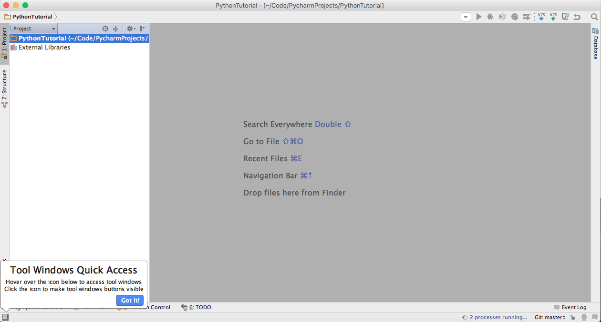
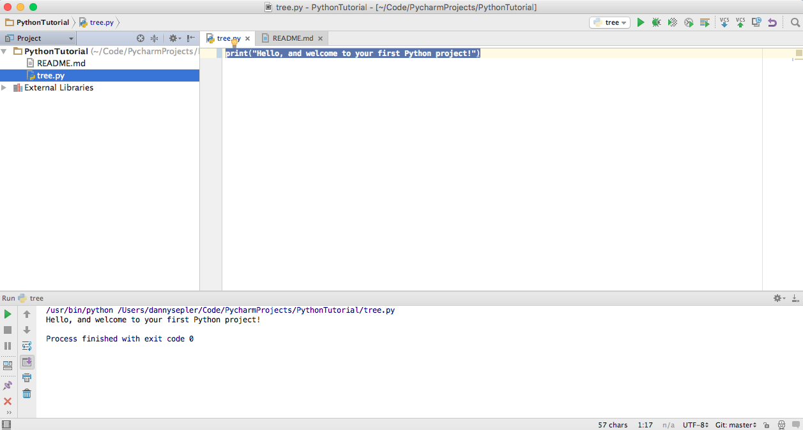
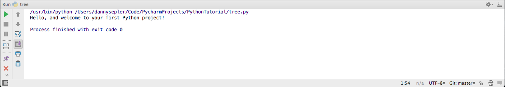
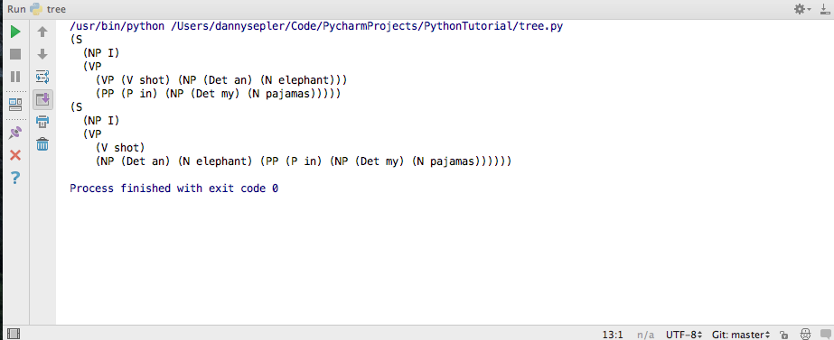

# Python Tutorial

## Introduction

Welcome to your first Python tutorial! In this program, we are going to use the NLTK library for Python, to create a semantic parse tree. We will be using GitHub to take some existing code, add to it, and then add it back to the "Repository".

To complete this tutorial, you will need:

 1. Python installed on your computer
 2. PyCharm
 3. Git installed
 4. A GitHub account

If you don't have any of these above, you can feel free to go to the [Resources](https://github.com/UF-CompLing/Resources/blob/master/Downloads.md) repository on the UF-Compling Github page.

## "Cloning" the repository

The first thing we will do is to move what's on the Github page into PyCharm. This is called Cloning. 

 * Fire up PyCharm
 * Click "Check out from Version Control"
 * A dropdown should appear, and then click GitHub
 * Input your GitHub username and password
 * Leave the Master Password area blank
 * Under Git Repository URL, input https://github.com/UF-CompLing/PythonTutorial.git
 * It will ask whether you want to open the directory. Click "Yes".

PyCharm's editor should open. It should look like....



## Run the program

First, we will open up the source code. 

* On the top, left side of the editor, you should see two folders: one labeled "PythonTutorial" and another labeled "External Libraries". 
* Double-click the PythonTutorial folder to open it. It should open up the files inside.
* Double-click the "tree.py" file. This should open up the source code on the main window.



To run it, Python needs to know which file to run. 

* Click the "Run" toolbar on the top of the screen, and then click "Run...."
* Press the "tree.py" file
* If the file hasn't run already, press the play button on the top right

On the bottom of the screen (the "console"), it should read this:



## Branch

First, we will switch to a new branch.

* Select "VCS" on the top toolbar
* Click Git->Branches->New Branch
* Give the branch a name, and press "Okay"

You have now switched to a new branch. For information on what a branch is, navigate to this [explanation](https://github.com/UF-CompLing/Resources/blob/master/WhatIsGit.md#with-version-control).

To push this branch into the Repo,

* Select VCS->Git->Push

And voila!

## Downloading NLTK (optional)

(This only needs to be done once. If you have done the following before, feel free to skip it.)

Remember that to complete this tutorial, you need to have NLTK downloaded. If you did not download it, please click [here](https://github.com/UF-CompLing/Resources/blob/master/Downloads.md) to learn how to do so.

Erase the contents of your file, and type in....

```python
import nltk

nltk.download()
```

* Run the file
* Click on the Python pop-up that appears. (As of December 29, 2015, the thumbnail should look like a rocket ship.)
* Click Download on the bottom-left of the popup screen. This will download the important packages.

## Create a parse tree

Erase the contents of your file, and type in...

```python

import nltk

groucho_grammar = nltk.CFG.fromstring("""
    S -> NP VP
    PP -> P NP
    NP -> Det N | Det N PP | 'I'
    VP -> V NP | VP PP
    Det -> 'an' | 'my'
    N -> 'elephant' | 'pajamas'
    V -> 'shot'
    P -> 'in'
    """)

sent = ['I', 'shot', 'an', 'elephant', 'in', 'my', 'pajamas']
parser = nltk.ChartParser(groucho_grammar)
for tree in parser.parse(sent):
    print(tree)

```

Run this file, and your should output something that looks like...



## Add, Commit, and Push

Now we want to put the code onto GitHub. To do so,

* Go to VCS->Git->Commit File
* Add a commit message. Something along the lines of: "Inputted code to create parse tree."
* Hover your mouse over "Commit" on the bottom-right of the screen, and click "Commit and Push".

This moved your code to your own branch online. Try to find it on the [repository](https://github.com/UF-CompLing/PythonTutorial) now!

## Congrats!

You have now completed the Python and GitHub tutorial. I cannot wait to see you become an actively contributing member to the many projects out there today.

Best of luck, and cheers!

From, Danny